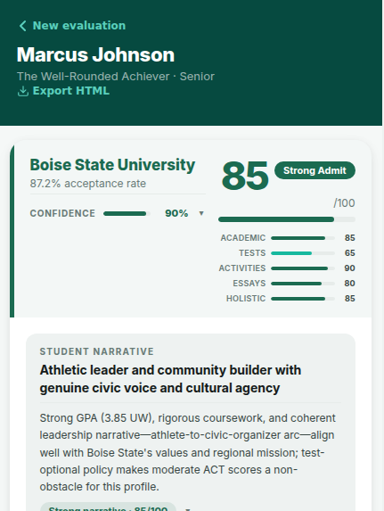
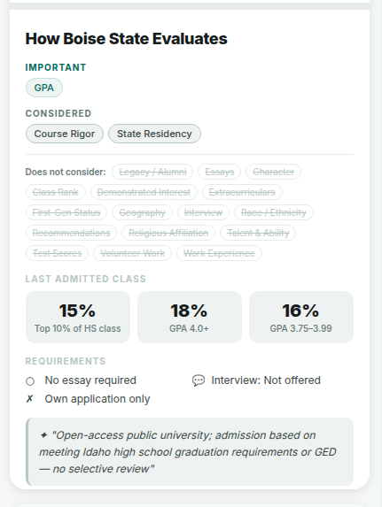
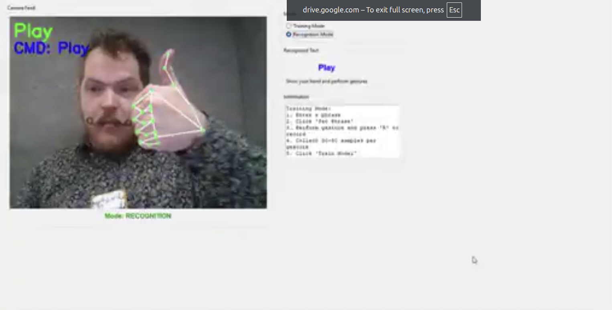
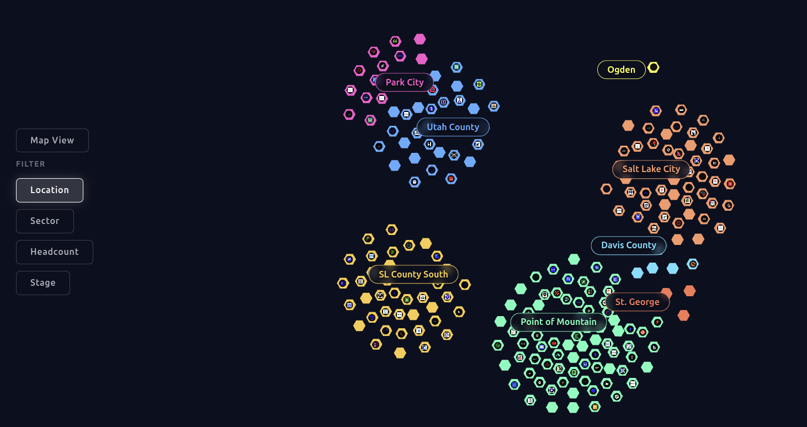
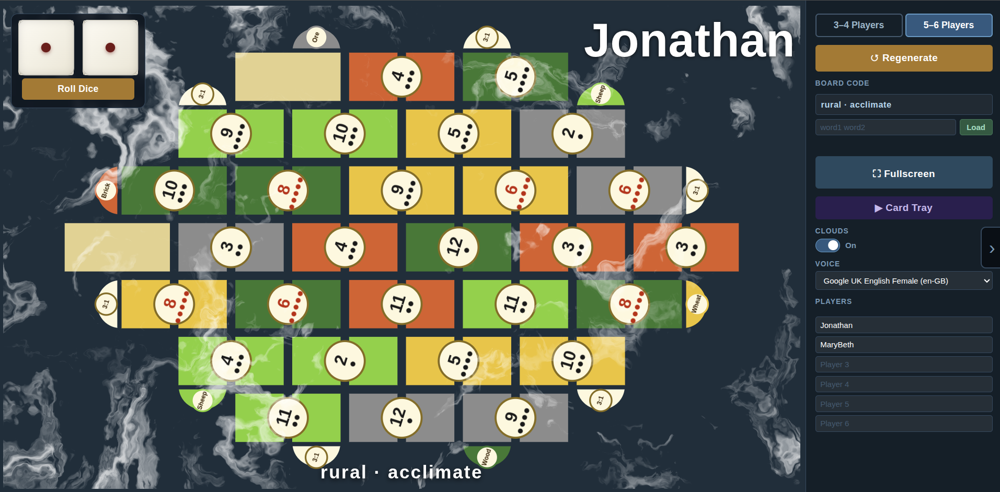
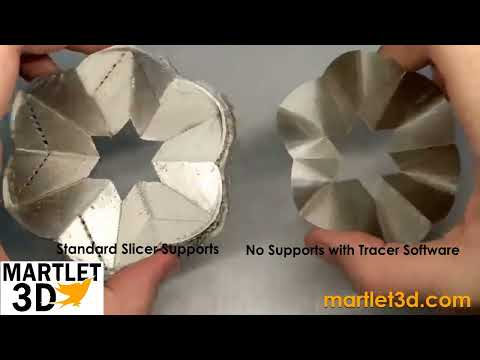

# Jonathan Wagstaff

[LinkedIn](https://www.linkedin.com/in/wagstaffjonathan/)

## About

I am a contrarian at heart who strives to build unique solutions. As a solo entrepreneur, I am reinventing 3D printing through Martlet3D, drawing on my background in Electrical Engineering and Advanced Manufacturing.

I also love frequenting hackathons to share creative approaches, meet other builders, and keep learning. You can often find me at Utah County's **Just Build** group.

## Hackathon wins

Both were team efforts; the notes below highlight my key contributions.

🏆 **1st Place, HALDA Bounty HITLAB World Cup: Innovation Hackathon — July 2026**

**[Halda](https://github.com/jonathanmwagstaff/HaldaHackathon/blob/docs/halda-readme/README.md)** — AI college guide that makes college admissions more transparent and approachable. I built its acceptance-committee simulator, helping students see how an application may be evaluated, as well as the community and Connect experience.

🏆 **Most Multimodal — Utah Tech Week Just Build Hackathon — Jan 2026**

**[Ditch Your TV Remote](https://drive.google.com/file/d/1thvM3a6NS-fwlF9z9y6-qYLL01iuDoFT/view?usp=drive_link)** — Hands-free TV control through voice and gestures. I set up and trained the **Gesture Classifier**, a custom gesture-recognition system. [Watch the Gesture Classifier demo →](https://drive.google.com/file/d/1thvM3a6NS-fwlF9z9y6-qYLL01iuDoFT/view?usp=drive_link)

## Other projects

**[GOED](https://github.com/jonathanmwagstaff/HackathonGOED)** — An interactive explorer for Utah's innovation ecosystem. Rather than a conventional geographic map, I designed it as a filterable mind map that makes company hubs and relationships easier to explore by location, sector, headcount, and stage.

**[Catan Hybrid Board](https://github.com/jonathanmwagstaff/catan-hybrid-board)** — I got tired of setting up CATAN boards, so I made a live board companion for playing with the real physical pieces. It is a hybrid augmented-reality experience: the screen handles setup, board generation, number tokens, dice, and game coordination, while the tactile, social heart of CATAN stays on the table—where players still hold, trade, and play with the pieces.

_More projects coming soon._

## Day job — Martlet3D

I am the solo founder of **[Martlet3D](https://martlet3d.com)**, a software alternative to conventional 3D-print slicing. Instead of treating every model as a stack of flat layers and relying on breakaway supports, I am developing new toolpaths that make difficult overhangs printable with smoother surfaces and less support material.

[Watch the overview video →](https://www.youtube.com/watch?v=aoUnvP_QV7g) · [Join the beta-software mailing list →](https://docs.google.com/forms/d/e/1FAIpQLSeV77oK-KVBiLZU7xFQWJrQk3N3qGREzHL8F-yRtl9s-7Gw8w/viewform?usp=dialog)

_The Martlet3D website is currently being rebuilt and is not live yet._
